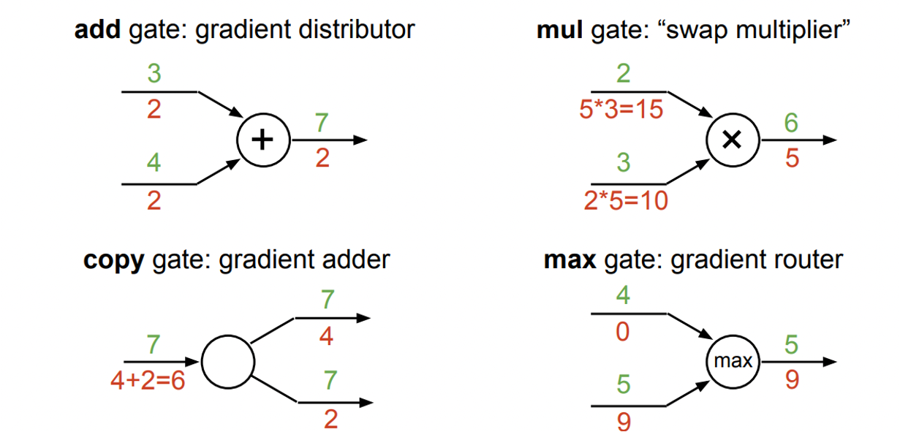
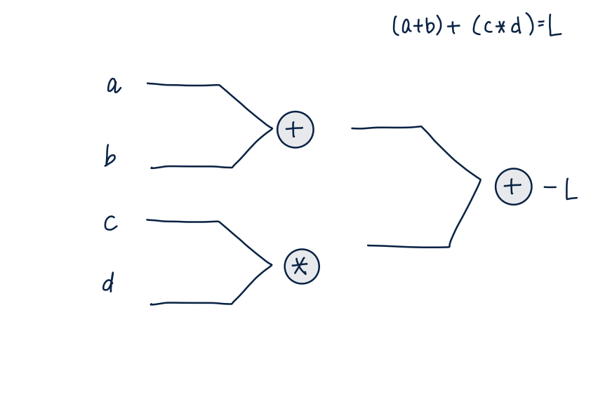
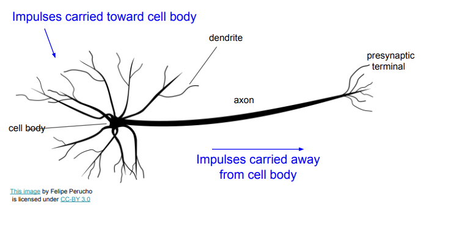

# CS231n 4강

2021.04.28

# 1.Gradient

: 다변수 함수의 모든 입력값에서 모든 방향에 대한 순간변화율

- 기울기와 다른점은, 변수의 편미분값을 원소로 하는 벡터라는 점

- local gradient 만 알 숭 ㅣㅆ음 그 일련의 local gradient들을  모아서 끝과 끝의 gradient계산

- 이렇게 쪼개는게 좋은 이유는 very simple한 계산으로 쪼갤수 있다. 12:00~
- upstream gradient coming down and we multiply it by the local gradient.

# 2. Computational graph

: 함수의 연산과정을 그래프로 나타낸것

- 모든 함수는 computational graph로 나타낼 수 있어야 한다.
- 연산 노드들은 다양한 gate들로 이루어진다.

# 3. feed forward - Back Propagation

- feed forward: 각 노드들의 gradient들을 계산해서 보관해놓는 과정
- back propagation : 결과값부터 시작해서 거꾸로 gradient들을 전파해 최종적으로 입력층의 입력변수가 결괏값에 끼치는 영향(=gradient)들을 구하는 과정. 이 과정에서 chain rule이 연쇄적으로 사용된다.

## example of back propagation

# 4. jacobian matrix

: 다변수 벡터 함수의 도함수 행렬

- 입력변수가 스칼라 값이 아닌 벡터로 입력이 되면, 야코비안 행렬을 이용해서 gradient를 표현할 수 있다.

    # 5. Neural Network

    

    인간의 신경전달계 뉴런을 본따 네트워크화 시킨 모델. 딥러닝의 근간이 됨