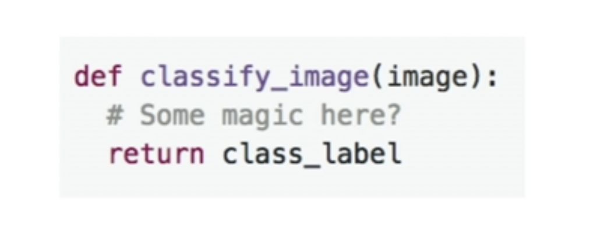
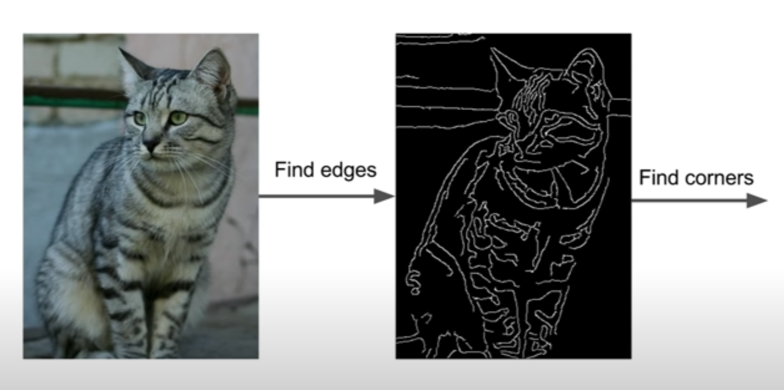
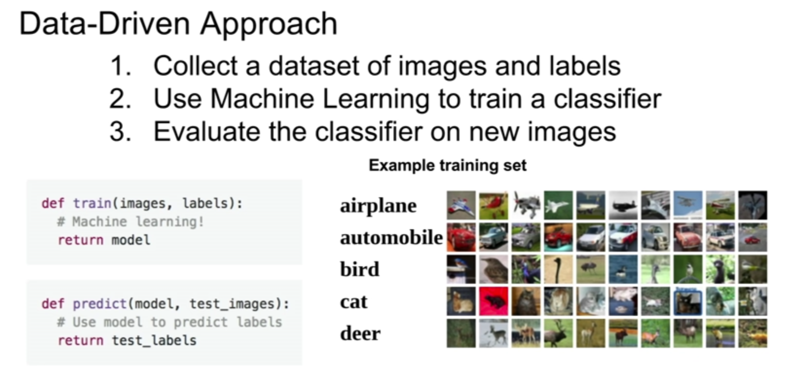
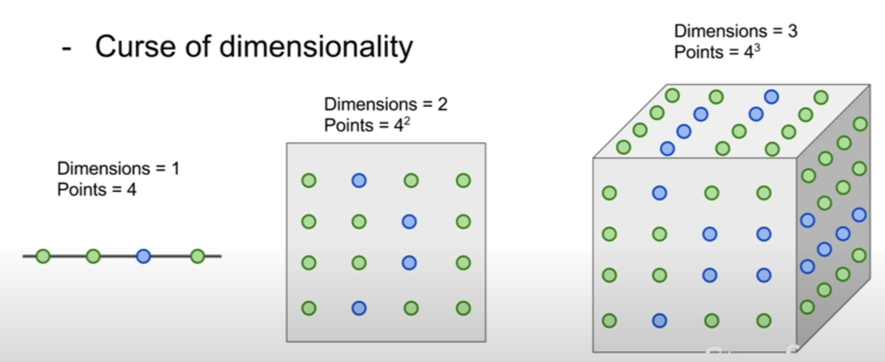
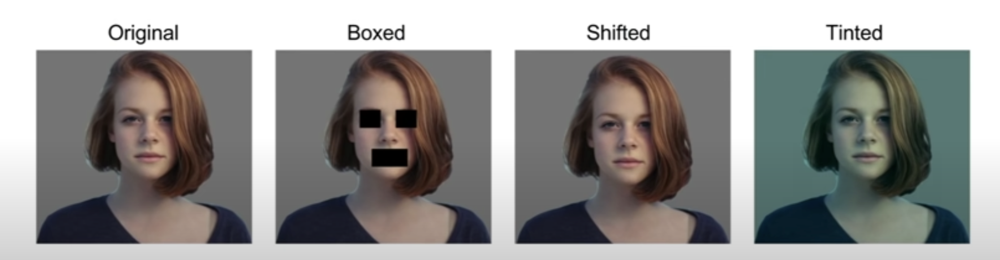

# CS231n 2강

2021.03.27

# 🥑 1. Image classification

- A core task in computer vision
- A computer looks at a picture and then assign it from one of thr fixed category labels.

          → very hard for computers because computer sees an image as a gigantic grid of numbers.

Computers's vision VS. Human's vision. = SEMANTIC GAP

- Image classification의 또다른 장애물

    : 보는 관점, 광량, deformation, occlusion....

 

# 🥑2. Attempts of Image classifier

특정 객체를 식별하는 뚜렷한 알고리즘은 존재하지 않는다. 그럼 어떻게 이미지 분류기를 구현할 수 있을까?

2-1 . Rules for each object

- 객체별 특징을 반영한 개별 분류기 (e.g. 고양이의 경우 세개의 선이 만나면 모서리라고 보고 귀로 판단, 귀가 어디에 몇개있냐에 따라 고양이를 판단하는 기준이 될 수 있음.)

    → too brittle, 객체마다 처음부터 코드를 다시짜야됨. 비효율적

2-2. Data-driven approach - collect a large dataset of images and labels

2-3. Nearest-Neighbor

2-4. Distance matrix -simple but 새로운 문제 발생히 가장 먼저 살펴보면 좋을 파라미터. 여러가지가 있고 다양한 문제에 적용가능 (L1 distance, L2 distance...)

# 🥑3. Hyperparameters

→ choices about the algorithm that we set rather than learn.

→ PROBLEM DEPENDENT. 이것저것 다 시도해보고 최선의 선택을 하는게 중요.

# 🥑4. Knn

→ K개의 근처 점들을 근거로 분류하는 기법. 이미지를 분류할때 거의 사용하지 않음

- Curse of dimensionality

    

    → 위에서 파란점은 test, 초록점은 train data라고 가정한다. 

    → 차원이 커질수록 공간을 빽빽하게 메우기 위해서 필요한 점들의 개수가 기하급수적으로 증가한다.

    이를 Curst of dimensionality라고 한다.

→ 위의 사진들은 KNN으로 분류했을때 모두 똑같다고 판단한다.

# 5. Linear classification🤩 (parametric model)

→ f(x,W) : x 는 input data, W는 weights. 이미지를 입력값으로 넣으면 고유함수 f(w)에서 이미지의 출력값을 계산하고 이를 바탕으로 미리 정해놓은 카테고리중 어느곳에 속하는지 선택 할 수 있다.

왼쪽 W부터 순서대로 weight, input, bias, result score for each class.