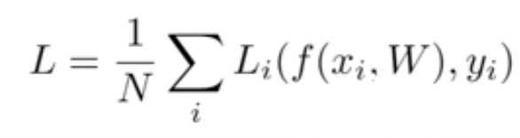
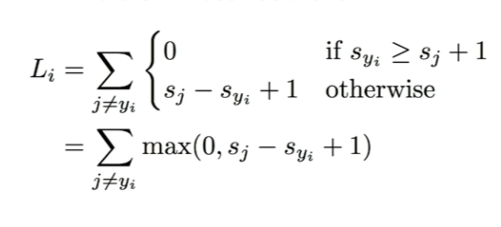
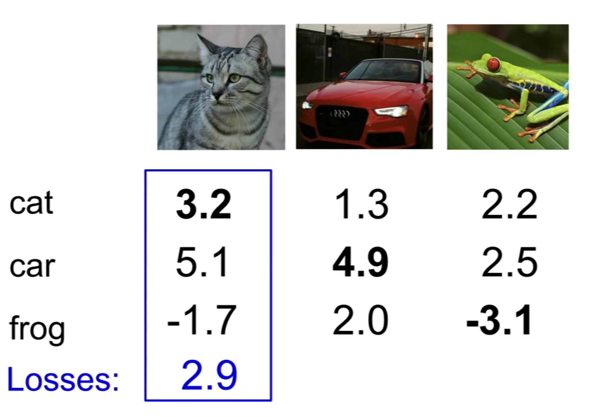

# CS231n 3강

2021.04.03

# 1.loss function (손실함수)

: tells how good or bad our current classifier is.

- Xi : input
- Yi : Label (predicted label)

## 1.1 SVM (relative differences of the score)

: incorrect score를 판가름할 safety margin이라는게 있는데, 만약 입력값과의 차이가 safety margin보다 크면 loss를 아예 0으로 판단. (Sj : predicted scores, Syi : score of the true class)

- cat 클래스의 loss를 구하는 과정

    → cat 클래스(true class) 외 다른 클래스들 car, frog는 각각 Sj이다. Cat 클래스와 같은 true class는 Syi.

    → max(0, Sj - Sy1 + 1) + max(0, Sj - Sy2 + 1)

      = max(0, 5.1-3.2+1) + max(0, -1.7-3.2+1) = 2.9

1. Q1 : What happens too loss if car scores change a bit? 

    → 큰 상관없다. 어차피 svm에서는 true class의 값이 다른 class 보다 1 이상큰지 확인하고 싶은거고 car class 는 다른 클래스들보다 이미 훨씬 크기 때문.

2. Q2 : What is the min/max possible loss?

    → 0, ♾️

3. Q3 : At initialization W is small so all as s =~0 What is the loss?

    → # of class -1

4. Q4 : What if we use mean instead of sum?

    → Doesn't matter. relative value is what matters. The absolute values aren't important.

## 1.2 Regualrization⭐️

- L2 regularizatiton
- L1 regularization
- Elastic Net( L1 + L2 )
- Dropout

## 1.3 Softmax Classifier ?

# 2. Optimization

: 최적의 W를 찾는것