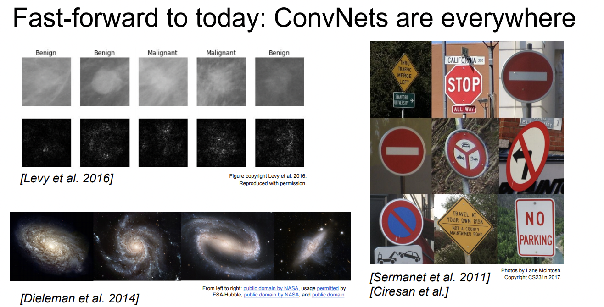

# CS231n 5강

## 1. Convolutional Neural Networks

- 이 그림에서 5*5*3은 필터의 사이즈이다. 이 필터를 원본 이미지에 슬라이드 시키면 28*28*3 사이즈의 이미지이다.
- 필터는 항상 input volumedml depth를 만족시켜야 된다.
- activation maps : 원본 이미지에 하나의 필터를 슬라이딩 시켜서 구해낸 이미지

- activation map은 사이즈가 줄어들 수 있다. 이런 경우에 여러번 필터를 적용시키면 이미지 사이즈가 너무 감소해 데이터를 손실할 수 있다. → padding을 적용해 방지 가능

- 위 그림은 각 activation map들을 나타낸 것이다. 그 위에 있는 filter들은 그림에서 찾아야 하는 부분들을 필터로 나태낸 것이다.

## 2. Max Pooling

- Contains neurons that connect to the entire input volume, as in ordinary Neural
Networks