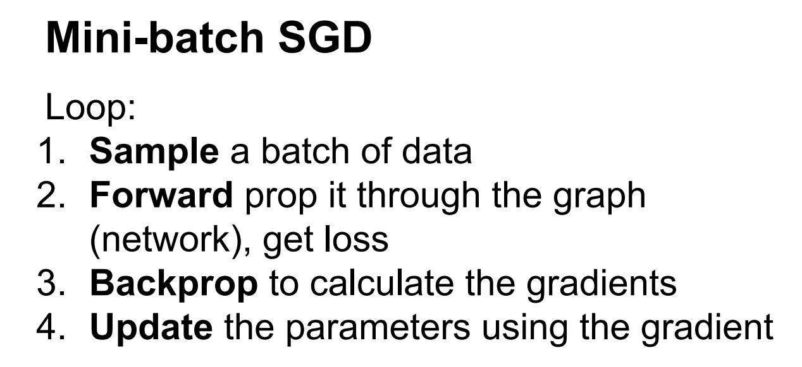
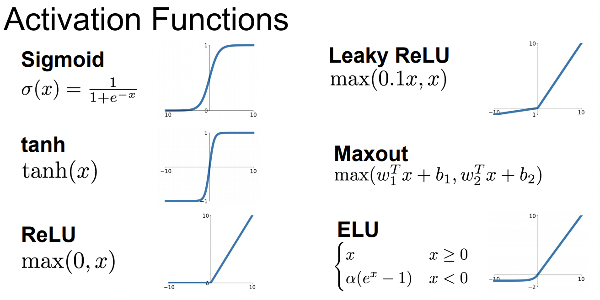
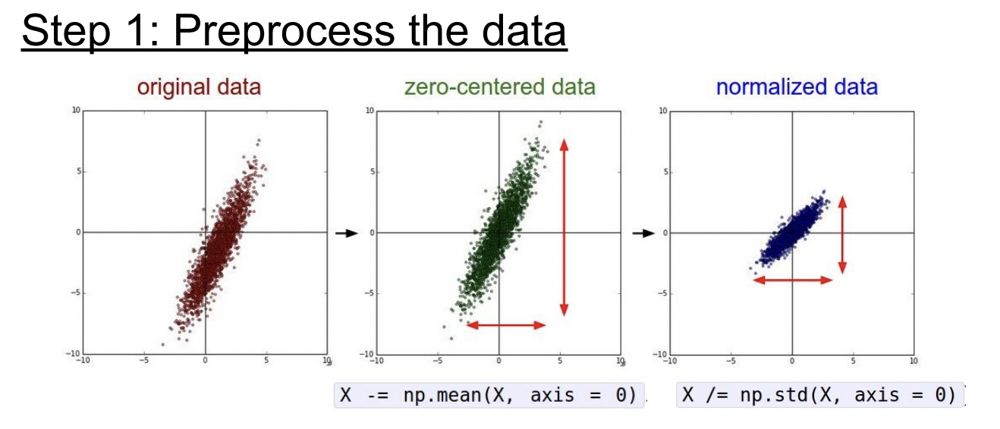

# CS231n_6강

## 1. Review

Mini-batch SGD를 사용해 더 샘플링된 데이터로 학습시킬 수 있다

## 2. Activation Function

- 여러가지 종류가 있고 그중에서 가장많이 사용하는것은 relu이다.
- activation function은 neural net에 nonlinearity 를 첨가해 XOR같이 linear function으로 해결할 수 없는 문제들을 해결하기 위해 사용된다.

### 2-1. Tanh

- Squashes numbers to range [-1,1]
- zero centered (nice)

### 2-2. Sigmoid

- Squashes numbers to range [0,1]
- Historically popular since they have nice interpretation as a
saturating “firing rate” of a neuron

### 2-3. Exponential Linear Units(ELU)

- All benefits of ReLU
- Closer to zero mean outputs
- Negative saturation regime compared with Leaky ReLU adds some robustness to noise

## 3. Data Preprocessing ⭐⭐

