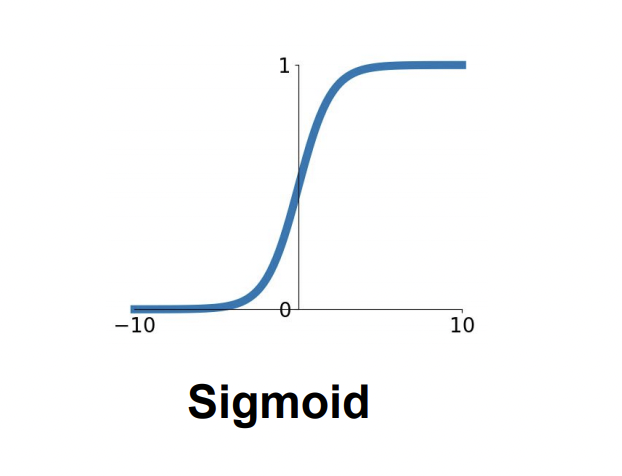
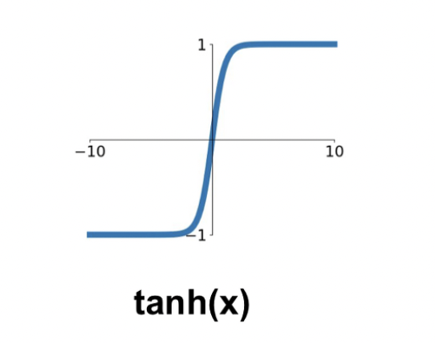
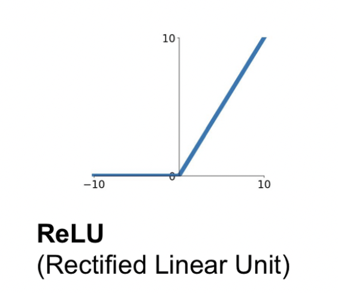
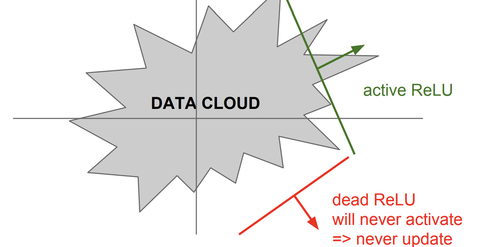
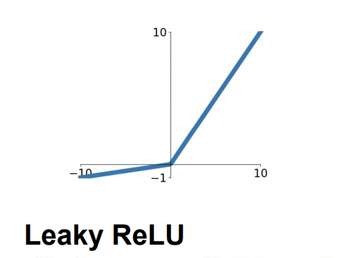
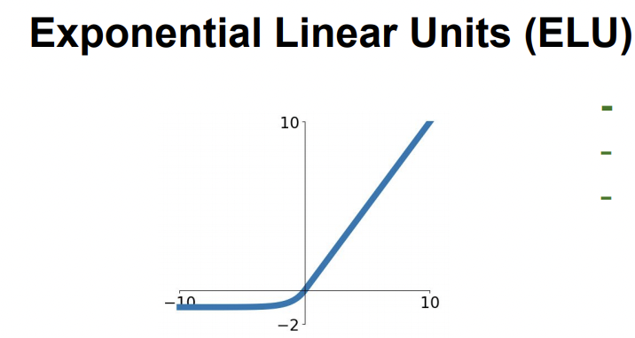

# CS231n_6강

## Training Neural Networks Part I - Activation Function

2021.05.16

## 1. Activation Function

activation funtion, 활성화 함수는 다음 뉴런에게 값을 전달할지 말지를 정하는, 즉 **뉴런의 활성화 여부**를 정하는 역할을 한다. 이렇게 활성화 함수가 필요한 이유는, 활성화함수가 Wx+b로 이루어진 linear function에 **non-linearity**를 더해주기 때문이다. (XOR 같이 linear function으로는 절대 해결할수 없는 문제를 해결할수 있는 방법이 activation function의 사용이다.)

activation function에는 여러가지 종류가 있고, 종류에 따라서 어떤 기준치로 활성화 시킬지가 달라지기 때문에 학습 결과도 달라진다.

### < Sigmoid >

$$\sigma(x) = \frac{1}{1+e^{​‑x}}$$

전통적으로 많이 사용되던 함수. 그래프로 알 수 있듯이 0 과 1 사이의 출력값을 갖는다는 특징이 있다. 

Sigmoid를 예전에는 많이 사용했으나 현재는 잘 사용하지 않는 이유는 세가지 큰 결함이 있기 때문이다.

1. Saturated neurons **“kill” the gradients**

$x$가 -♾️또는 ♾️로 발산하는 경우에는 각각의 기울기가 0으로 **saturated** 한다. 이는 Back Propagation을 할때 0이 곱해지는 결과를 낳고 해당 뉴련의 라인을 비활성화 시키는 결과가 발생한다 → **Vanising Gradient Problem**

2. Sigmoid outputs are **not zero-centered**

뉴런의 input값(위 예시에서는 x)가 항상 양수의 값을 갖는다면?

결론부터 말하자면 W에 대한 gradient가 항상 양수거나 항상 음수로 같은 방향을 갖는다.

-2.jpg)

해결방법은 **zero-mean data**

input값 X가 양수/음수를 모두 가지고 있으면 gradient w가 전부Positive / Negative로 움직이는 것을 방지할 수 있다.

## < tanh >

- 출력값 [-1,1]
- **zero centered** (nice)
- 그치만 **killing gradient** 문제 여전히 발생(기울기가 flat한 부분에서)

## < ReLU >

$$f(x) = max(0,x)$$

ReLU함수도 굉장히 많이 사용되는 함수중 하나다.

Sigmoid가 -♾️또는 ♾️로 갈수록 gradient가 0이 되며 vanishing한다면, RELU는 0이하의 값에서 gradient가 0이된다.

장점으로는

- 계산 효율이 뛰어나다, 그냥 max값 찾는 간단한 식이기에 exp같은 계산과정이 들어있는 sigmoid나 tnah보다 훨씬 빠르다.
- 생물학적 타당성이 가장 높다(?)

단점으로는

- non- zero-centered
- 음수에서 saturated, vanishing gradient
- **DEAD ReLU**현상이 발생할 수 있다. 아래에서 살펴보자

**DEAD ReLU** 

data cloud : all of our training data, 이 그림은 2D weight의 예시

ReLU의 왼쪽에 모든 데이터가 위치하게 되는 상황..

모든 gradient가 0이 되기 때문에 어떤 업데이트도 발생하지 않고 결국 죽어버리게 되는 것, 초기화를 영 잘못해버리거나 learning rate가 너무 클때 이런문제가 생긴다.

Unfortunately, ReLU units can be fragile during training and can “die”. For example, a large gradient flowing through a ReLU neuron could cause the weights to update in such a way that the neuron will never activate on any datapoint again. If this happens, then the gradient flowing through the unit will forever be zero from that point on. That is, the ReLU units can irreversibly die during training since they can get knocked off the data manifold. For example, you may find that as much as 40% of your network can be “dead” (i.e. neurons that never activate across the entire training dataset) if the learning rate is set too high. With a proper setting of the learning rate this is less frequently an issue. 

## < Leaky ReLU >

$$f(x) = max(0.01x,x)$$

ReLU의 변형. “dying ReLU” problem을 고치기 위해 만들어졌다.

## < PReLU >

$$f(x) = max(\alpha x,x)$$

leaky ReLU가 negative slope에서 0.01을 곱해서 dying을 방지했다면, PReLU는 alpha를 곱해서 **hyperparameter화** 시킨다. 

알파값을 hard-code하지 않고 backprop해서 최적의 알파값을 찾는다.

### < ELU >

$$f(x) = \begin{cases}x & \text{if } x\gt 0\\ \alpha(exp(x)-1)& \text{if } x\le 0
\end{cases}$$

어쩌구저쩌구~LU가 정말 많다.. ELU는 Exponential Linear Units의 약자인데,

- ReLU의 장점은 다 가졌다
- Closer to zero mean outputs
- 하지만 negaitve regime에서 "기울기"가 있는 대신 0으로 **saturated** 되는 문제가 발생한다는 점 → 하지만 오히려 saturation덕분에 noise에 robust하다고 ELU 논문에서 주장한답니다. 관심있으신분은 👉👉  [ELU논문](https://arxiv.org/pdf/1511.07289.pdf)

## < Maxout "Neuron" >

$$max(w_1^Tx + b_1, w_2^Tx + b_2)$$

Maxout은 여태껏 봐왔던 활성함수와 조금 다른 느낌인데, ReLU 와 Leaky ReLU를 합쳐서 만들었다. 각각의 단점을 상쇄시키지만. 두개의 선형함수를 취해서 뉴런당 파라미터의 수가 두 배가 된다는 점

---

지금까지 activation function의 종류와 각각의 특징들에 대해 알아봤는데.

실제로는 **ReLU**가 가장 많이 사용됩니다. 다만, DEAD ReLU를 피하기 위해 learning rate에 주의해야 한다는 점.

그리고 Sigmoid 함수는 사용하지 않는다고 하네요. 버려진 시그모이드 😇