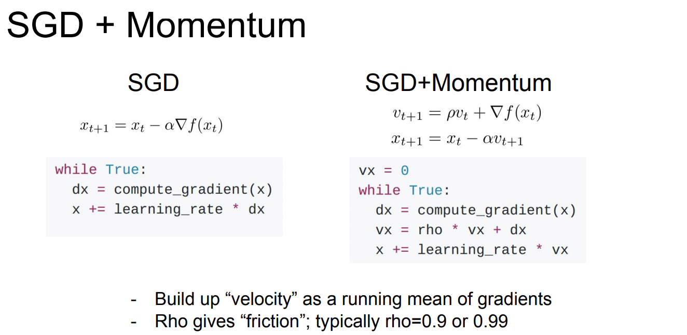

# CS231n 7강

## Training Neural Neworks II

2021.05.21

---

optimazation을 할때 맞닥뜨릴수 있는 문제들

- SGD의 문제 - 만약 W가 w1,w2의 2차원 형태일때, w1의 변화에는 둔감하게 반응하고 w2의 변화에는 민감하게 loss가 반응할때→ 이거는 한 예시일뿐이고 실제로 loss function은 타코셸 모양으로 특정 방향으로 이동하는게 더 민감할 수가 있다 (??무슨소리지) // lecture note 참고

    

- local minima, saddle point. Saddle point보다 local minimac가 더 유명하지만 실제로 레이어가 많은 모델들을 다루면 saddle point가 문제를 일으킨다. 그리고 saddle point에서 gradient가 매우 작아지는데 ( 경사가 급완만해지기 때문에) 그런 점에서 학습이 느리고 진행이 느려진다. **gradient descent gets stuck**

## 1. Fancy  Optimization

- add a momentum to the desdent!

    기울기가 0인 지점이 나와도 멈추지 않는 힘 : momentum

    

    hyper parameter 'rho'

    효과가 좋음 get over local minima / saddle point (왜?)

    

- 이 그림은 뭘까?.. 등고선?.. 그리고 빨간선이 위아해호 가는거 그건 어떤식으로 움직이는 걸까

    

    

## 2. Ada Grad

: adaptive learning rate method originally proposed by Duchi et al.

근데 decaying gradient 때문에 한곳에 고착돼서 멈춰버릴수 있다.

## 3. Adam

: AdaGrad와 RMSProp, momentum의 장점을 합친것

Fisrt Order optimization

어떠한 손실함수에서 기울기가 음인 방향으로 이동하는데, 한 지점에서 구한 미분값은 그 범위의 영향력이 널리 미칠수 없기 때문에 많이 이동을 할 수 가 없다.

Second Order optimization

quadratic approximation 을 사용하면 한방에 minima 를 도달할 수 있다.

- learning_rate가 없다. 항상 미니멈으로 가서.!!